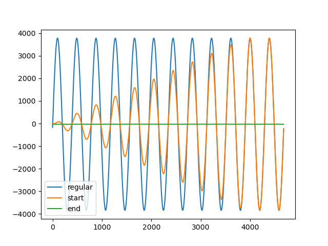

# Ramping Example

In this example we ramp up the amplitude of our signal over 10 periods and we retrieve the first 12 periods of samples. Then after a wait we receive the next 12 periods. Afterwards we trigger the ramp down of the signal. As this is triggered by a command that is sent over the network it varies when the ramp down actually start. A ramp down can be triggered at a specific point with the help of a sequence.

To run this example connect the RedPitaya in the following way.


It is also possible to update the signal type during the acquisition without going back to the `CONFIGURATION` mode.

## Julia Client

This and all other examples are located in the ```examples``` [directory](https://github.com/tknopp/RedPitayaDAQServer/tree/master/src/examples/julia)

````@eval
# Adapted from https://github.com/JuliaDocs/Documenter.jl/issues/499
using Markdown
Markdown.parse("""
```julia
$(open(f->read(f, String), "../../../src/examples/julia/ramping.jl"))
```
""")
````


