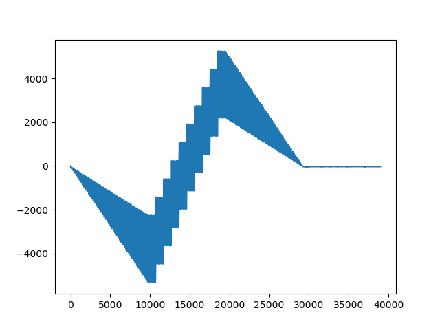

# Sequence Ramping Example

In this example we combine the [ramping](ramping.md) and the [sequence](sequence.md) example to create a signal with known/predictable ramping behaviour. The ramping period is independant of the sequence. The sequence we use is a sequence that holds the first value of our intended sequence for the duration of the given number of ramping steps, which spans the ramp up period.

At the end of the "regular" sequence portion, the ramp down is triggered and the sequence holds the last value of the "regular" sequence until the end of the ramp down.


It is also possible to update the signal type during the acquisition without going back to the `CONFIGURATION` mode.

## Julia Client

This and all other examples are located in the ```examples``` [directory](https://github.com/tknopp/RedPitayaDAQServer/tree/master/src/examples/julia)

````@eval
# Adapted from https://github.com/JuliaDocs/Documenter.jl/issues/499
using Markdown
Markdown.parse("""
```julia
$(open(f->read(f, String), "../../../src/examples/julia/seqRamping.jl"))
```
""")
````


