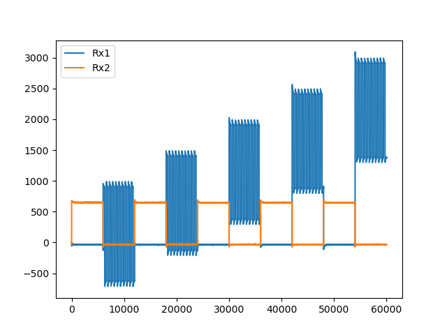

# Sequence Multi-Channel and Waveform Enable Example

This examples combines concepts from the three examples and additionally uses the signal enable feature of the sequences. This example uses both DAC and ADC channels of the RedPitaya. On the first DAC channel we output a square waveform composed with a climbing sequence. On the second channel we output just a sequence with a constant value and no waveforms at all. The signal enable flags of the sequences are set in such a way, that the two channels alternate being enabled with each step.


## Julia Client

This and all other examples are located in the ```examples``` [directory](https://github.com/tknopp/RedPitayaDAQServer/tree/master/src/examples/julia)

````@eval
# Adapted from https://github.com/JuliaDocs/Documenter.jl/issues/499
using Markdown
Markdown.parse("""
```julia
$(open(f->read(f, String), "../../../src/examples/julia/sequence.jl"))
```
""")
````


