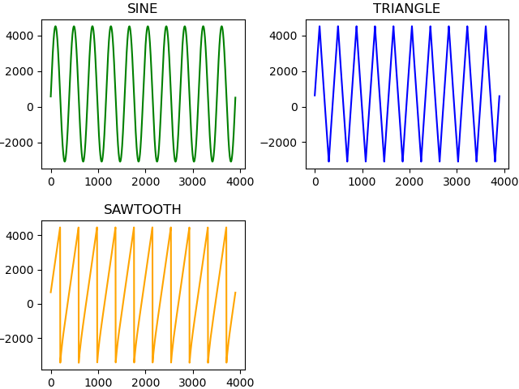

# Simple Example

In the first example we generate a sinus signal of frequency 10 kHz on fast DAC
channel 1 and receive the same signal on the fast ADC. To run this example connect
the RedPitaya in the following way.


## Julia Client

```julia
using RedPitayaDAQServer
using PyPlot

rp = RedPitaya("rp-f04972.local")

dec = 32
modulus = 4800
base_frequency = 125000000
samples_per_period = div(modulus, dec)
periods_per_frame = 10

decimation(rp, dec)
samplesPerPeriod(rp, samples_per_period)
periodsPerFrame(rp, periods_per_frame)

modeDAC(rp, "STANDARD")

frequencyDAC(rp, 1, 1, base_frequency / modulus)
println(" frequency = $(frequencyDAC(rp,1,1))")

signalTypeDAC(rp, 1 , "SINE")

amplitudeDAC(rp, 1, 1, 0.5)
offsetDAC(rp, 1, 0)
phaseDAC(rp, 1, 1, 0.0 )

ramWriterMode(rp, "TRIGGERED")
triggerMode(rp, "INTERNAL")
masterTrigger(rp, false)
startADC(rp)
masterTrigger(rp, true)
uFirstPeriod = readData(rp, 0, 1)
sleep(0.1)
fr = currentFrame(rp)
@show fr

uCurrentPeriod = readData(rp, fr, 1)

figure(1)
clf()
plot(vec(uFirstPeriod[:,1,:,:]))
plot(vec(uCurrentPeriod[:,1,:,:]))
legend(("first period", "current period"))
```



